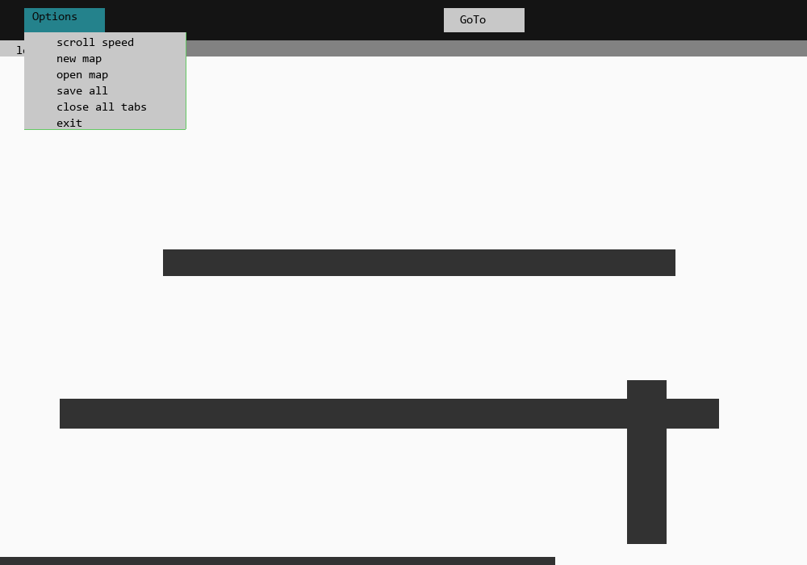

# Map_it
A super simple  mapping software for 2D games.

- I made this software in 2020 when I was quite a noob in Python
- Basically I used it to draw rects for my the Pygame  games
- It made work easier than drawing on paper and then transferring the data into the code
- I had not used engines like Godot or Unity before, but it did the job and I was happy :)

# USE
- run the MAPIT.py  file
  'python MAPIT.py'
  
# DEPENDENCIES
-make sure you have these libraries installed:
  >kivy
  >pygame
  
- feel free to update the code if it intrests you!
- :)
